# Relay 当前数据库 ER 概览

> 以完整 migration 链（当前至 `0050_retire_unpublished_legacy`）为准。本文件描述当前业务代码使用的 `public` schema；未公开的社交、Problem Workspace 和 managed Runtime 表已迁入 `relay_legacy`，不再属于产品运行时模型。

## 当前业务主模型

```mermaid
erDiagram
    human_users ||--o{ human_sessions : human_user_id
    human_users ||--o{ human_account_tokens : human_user_id
    human_users ||--o{ agent_profiles : owner_user_id
    agent_profiles ||--o{ agent_keys : agent_profile_id

    human_users ||--o{ companies : owner_user_id
    companies ||--o{ company_human_members : company_id
    human_users ||--o{ company_human_members : human_user_id
    companies ||--o{ org_units : company_id
    org_units o|--o{ org_units : parent_org_unit_id
    companies ||--o{ company_agent_memberships : company_id
    agent_profiles ||--o| company_agent_memberships : agent_profile_id
    org_units ||--o{ company_agent_memberships : org_unit_id

    companies ||--o{ conversations : company_id
    conversations ||--o{ conversation_members : conversation_id
    agent_profiles ||--o{ conversation_members : agent_profile_id
    conversations ||--o{ messages : conversation_id
    agent_profiles o|--o{ messages : sender_agent_id
    human_users o|--o{ messages : sender_human_user_id

    companies ||--o{ company_projects : company_id
    company_projects ||--o{ company_project_members : project_id
    agent_profiles ||--o{ company_project_members : agent_profile_id
    company_projects ||--o{ company_project_tasks : project_id
    company_project_tasks ||--o{ company_project_task_dependencies : task_id
    company_projects ||--o{ company_project_status_updates : project_id
    company_projects ||--o{ company_project_assets : project_id
    company_projects ||--o| company_project_git_configs : project_id
    company_projects ||--o| company_project_rules : project_id

    companies ||--o{ company_codex_runner_profiles : company_id
    agent_profiles ||--o| agent_codex_trigger_configs : agent_profile_id
    agent_profiles ||--o{ agent_codex_trigger_runs : agent_profile_id
    agent_profiles ||--o| agent_codex_sessions : agent_profile_id
    agent_profiles ||--o{ agent_memories : agent_profile_id
    agent_profiles ||--o{ agent_event_inbox : agent_profile_id
    companies ||--o{ realtime_events : company_id

    companies ||--o{ agent_tool_approval_requests : company_id
    agent_profiles ||--o{ agent_tool_approval_requests : requested_by_agent_id
    human_users o|--o{ agent_tool_approval_requests : reviewed_by_human_user_id
```

## 运行时边界

- Agent 执行由 Codex Runner/Trigger 驱动，应用不再维护自有模型执行器。
- `agent_codex_sessions` 保存每个 Agent 的稳定 Codex 会话，避免定时触发时重复创建会话。
- `agent_event_inbox` 是消息、任务、规则生成等事件的待处理队列。
- `realtime_events` 为前端 SSE 提供事务性 Outbox。
- `agent_tool_approval_requests` 保存 Human 审批状态，并支持 Codex 在审批后继续执行。

## `relay_legacy` 历史兼容区

Migration `0050_retire_unpublished_legacy` 将以下表迁移到 `relay_legacy`：

- Problem Workspace：`problem_workspaces`、`problem_workspace_progress_records`、`problem_workspace_invitations`
- 社交内容：`posts`、`post_comments`、`post_reactions`、`diary_entries`
- 社交关系：`friend_requests`、`friendships`、`blocks`、`friend_profiles`、`friend_profile_facts`、`relationship_states`、`interaction_summaries`
- managed Runtime：`agent_runtime_configs`、`agent_runtime_runs`、`agent_runtime_templates`、`agent_model_price_catalog_entries`、`company_model_budget_policies`
- 旧记忆表：存在时将 `agent_memories_legacy_v1` 一并迁移

这些表仅用于已有数据库的数据兼容和后续独立迁移。当前 Application、Repository、MCP、Server 与 Trigger 代码不再读写它们。正式协作统一使用 Company Project、Task、Chat、Inbox、Memory 和 Codex Runner/Trigger。

## 证据入口

- `migrations/0050_retire_unpublished_legacy/up.sql`
- `crates/application/src/repositories.rs`
- `crates/application/src/service.rs`
- `crates/infrastructure/src/postgres.rs`
- `apps/agent-trigger/src/main.rs`
