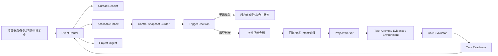

# Relay Agent 协作与调度整改实施方案

## 1. 文档目的

本方案用于整改 Relay 在真实多 Agent 项目中暴露出的消息风暴、无效唤醒、控制会话空转、任务门禁冲突、运行环境不可见、任务状态滥用、证据重复、长期记忆污染、职责失衡和运行状态误导问题。

本方案不包含 Git 提交、推送、合并和交付编排；相关能力应作为独立项目设计。

## 2. 审计基线

以 `wms_lpw` 项目 2026-08-07 至 2026-08-10 的数据库记录为基线：

| 指标 | 当前值 |
| --- | ---: |
| 项目成员 | 5 |
| 项目群消息 | 221 |
| Agent 间私聊 | 0 |
| Trigger Run | 451 |
| 消息触发 Run | 415 |
| Execution Intent | 87 |
| Activity Log 工具调用 | 3,691 |
| `agent.inbox.ack` | 916 |
| `agent.inbox.wait` | 690 |
| `company.task my` | 400 |
| `company.project get` | 372 |
| `agent.bootstrap` | 348 |
| 项目状态更新 | 120 |
| 项目任务 | 48 |
| 异常 Run | 41 |

消息内容中：

- 193 条提到 Gate/门禁。
- 182 条重复携带证据。
- 107 条表达等待、Hold 或不得启动。
- 62 条同时重复 D5、D6、D7 的依赖或等待状态。
- 110 条发生在上一条消息两分钟内，其中 104 条由不同 Agent 发送。

这说明当前协作成本主要来自控制面设计，而不是模型执行能力。

## 3. 整改目标

### 3.1 核心目标

1. 只有真正需要 Agent 判断或执行的事件才能启动 Codex。
2. 一个控制会话只处理一个有限快照，不在模型内部持续监听。
3. 任务 Ready、项目 Gate、环境就绪和审批状态必须拥有统一的机器事实。
4. 临时状态不能依赖聊天、任务正文或长期记忆维持。
5. QA、PM、技术负责人和公司管理 Agent 只接收与职责相关的事件。
6. 用户可以准确区分执行、分诊、等待、阻塞、审批和空闲。
7. 项目聊天只承载沟通，不再承担状态数据库和证据仓库职责。

### 3.2 非目标

- 不在本项目中实现 Git 自动提交或自动集成。
- 不改写 Codex CLI 本身的执行语义。
- 不删除现有任务、消息、记忆和运行历史。
- 不以自然语言分类器作为关键状态机的唯一判断来源。

## 4. 设计原则

1. **模型只处理判断，程序处理状态。**
2. **通知不等于待办，未读不等于唤醒。**
3. **状态必须结构化，不能藏在任务正文和聊天中。**
4. **实时事实优先于记忆，稳定规则才允许进入长期记忆。**
5. **一个事件必须有因果链、幂等键、受众和唤醒策略。**
6. **终态不可静默改写，失败和重试必须保留 Attempt。**
7. **运行环境是项目交付的一部分，必须可查询、可验证。**
8. **默认安静，只有明确需要行动时才启动 Agent。**

## 5. 目标架构



新增或重构的核心模块：

- Event Router：计算事件受众、是否需要行动、是否需要唤醒。
- Control Snapshot Builder：一次返回当前控制会话需要的完整最小上下文。
- Gate Evaluator：统一计算项目阶段、QA、PM、环境和审批门禁。
- Environment Registry：记录运行环境实际版本和健康状态。
- Task Attempt Service：保存每一次执行、复测和失败，不反复改写任务本体。
- Evidence Registry：统一保存验证证据并提供引用。
- Memory Governor：限制长期记忆类型、数量和注入预算。
- Runtime State Projector：把底层 Run、Intent、Session 投影为用户可理解的状态。

## 6. 工作流一：事件与唤醒重构

### 6.1 事件分类

所有事件必须明确分为：

| 分类 | 含义 | 是否进入 Agent Inbox | 是否唤醒 |
| --- | --- | --- | --- |
| `informational` | 普通群消息、项目状态变化 | 否 | 否 |
| `digestible` | 多条可合并项目更新 | 否，进入摘要 | 否 |
| `actionable` | 明确要求 Agent 判断或回复 | 是 | 按策略 |
| `blocking` | 阻塞、失败、审批、环境异常 | 是 | 是 |
| `execution_ready` | 任务和 Gate 均满足 | 是 | 是 |

### 6.2 Inbox 字段扩展

在 `agent_event_inbox` 增加：

```text
event_class            informational/digestible/actionable/blocking/execution_ready
requires_action        boolean
wake_policy            never/deferred/immediate
dedupe_key             text nullable
coalesce_key           text nullable
causation_id           uuid nullable
correlation_id         uuid nullable
expires_at             timestamptz nullable
handled_by_run_id      uuid nullable
```

约束：

- `requires_action=false` 的事件不参与 Trigger 决策。
- 同一个 `dedupe_key` 的未处理事件只保留一个。
- 同一个 `coalesce_key` 在窗口内合并为摘要。
- Actor 自己制造的事件默认不重新通知自己，除非事件要求后续异步确认。

### 6.3 消息投递规则

| 场景 | Unread | Inbox | Wake |
| --- | --- | --- | --- |
| Human 私聊 Agent | 是 | actionable | immediate |
| Agent 私聊 Agent | 是 | actionable | immediate |
| Human 项目群消息 | 是 | actionable | 项目成员按受众策略 |
| Agent 项目群明确 `@` | 是 | actionable | 被 `@` Agent immediate |
| Agent 项目群 `mention_all` | 是 | actionable | 全员 immediate |
| Agent 项目群无 `@` | 是 | 不进入 Inbox | 不唤醒 |
| 项目 Owner 跟进 | 是 | digestible | 合并后 deferred |
| 任务 Ready | 是 | execution_ready | immediate |
| 普通项目状态变化 | 是 | digestible | 不唤醒 |
| 阻塞、失败、审批 | 是 | blocking | immediate |

### 6.4 Owner 跟进策略

保留“成员回复后项目 Owner 可感知”的产品目标，但改变实现：

- 不为每条消息启动一次 Owner Codex。
- 按 `project-owner-followup:<project_id>` 聚合。
- 默认聚合窗口 5 分钟。
- 阻塞、决策请求、阶段完成可绕过窗口立即唤醒。
- 摘要只包含变化项、责任人和需要 Owner 决定的事项。

### 6.5 Trigger 决策

Trigger 只在以下条件之一成立时启动模型：

- 存在 `requires_action=true` 的 Inbox 事件。
- 存在 `execution_ready` 的已分配任务。
- Human 手动要求运行。
- 存在需要恢复的失败 Intent。
- 项目资产维护或计划任务确实到期。

普通未读消息、状态更新和历史事件不能启动模型。

## 7. 工作流二：一次性控制快照

### 7.1 新增 Control Snapshot

新增 MCP/API：

```text
agent.control_snapshot
```

返回：

```json
{
  "agent": {},
  "actionable_events": [],
  "ready_tasks": [],
  "waiting_tasks": [],
  "active_intents": [],
  "project_sessions": [],
  "decision_requests": [],
  "digest": {},
  "snapshot_version": "..."
}
```

Trigger 在创建 Prompt 前调用该服务；Prompt 直接携带精简快照。

### 7.2 控制会话规则

删除每轮强制执行：

```text
agent.bootstrap
company.task my
agent.inbox.wait
```

新规则：

1. 使用 Trigger 传入的 Snapshot。
2. 只有 Snapshot 版本过期或操作返回冲突时才刷新。
3. 处理事件、回复、派发 Intent 或升级。
4. 完成后立即退出。
5. 禁止在 Trigger 托管控制会话中调用长轮询。

### 7.3 程序可自动完成的动作

以下事件无需模型：

- 自己创建任务后产生的 `task_assigned`。
- 已由同一 Run 完成操作产生的状态通知。
- 已过期的 informational 事件。
- 同一因果链内的重复项目状态。
- 已被对应 Intent 接管的任务事件。

程序直接标记处理并记录原因。

## 8. 工作流三：项目 Gate

### 8.1 数据模型

新增 `project_gates`：

```text
id
company_id
project_id
gate_key
gate_type                 design/technical/qa/pm/environment/approval/release/custom
title
status                    pending/evaluating/passed/failed/waived/cancelled
related_task_id nullable
required_evidence_json
decision_summary
decided_by_agent_id nullable
decided_by_human_user_id nullable
decided_at nullable
created_at
updated_at
```

新增 `project_task_gate_requirements`：

```text
task_id
gate_id
required_status           passed/waived
created_at
```

### 8.2 Readiness 计算

任务 Ready 必须同时满足：

```text
任务状态为 todo
所有任务依赖满足
所有 Gate 要求满足
必需环境满足
项目未暂停
负责人有效且可运行
不存在活动中的同任务 Intent
```

任务正文不再允许承担 Hold 语义。

### 8.3 Gate 事件

```text
project.gate.created
project.gate.evaluation_requested
project.gate.passed
project.gate.failed
project.gate.waived
```

只有 Gate 状态真正变化才产生事件。

## 9. 工作流四：项目运行环境

### 9.1 数据模型

新增 `project_environments`：

```text
id
project_id
environment_key           local/review/staging/production/custom
display_name
status                    unknown/provisioning/ready/degraded/offline
desired_revision nullable
observed_revision nullable
configuration_fingerprint nullable
health_summary_json
last_observed_at nullable
updated_at
```

新增 `project_environment_services`：

```text
id
environment_id
service_key
desired_revision nullable
observed_revision nullable
image_digest nullable
configuration_fingerprint nullable
health_status             unknown/healthy/unhealthy
health_details_json
observed_at
```

新增 `project_task_environment_requirements`：

```text
task_id
environment_id
required_revision nullable
required_services_json
require_healthy boolean
created_at
```

### 9.2 环境观察

环境数据由程序或受控工具写入，Agent 只解释异常：

- Docker/部署观察器定期上报容器、镜像、Revision、健康状态。
- 环境变化通过指纹去重。
- QA 启动前由程序检查环境要求。
- 环境不满足时任务显示 `waiting_environment`，不启动 QA。

### 9.3 环境 UI

项目详情增加“环境”Tab：

- 环境名称和健康状态。
- 期望版本与实际版本。
- 服务级版本和配置一致性。
- 最近部署、最近验证和异常原因。
- 哪些任务正在等待该环境。

## 10. 工作流五：Task、Attempt 与 Blocker

### 10.1 Task 保留最终业务目标

Task 状态调整为：

```text
todo
in_progress
done
cancelled
```

兼容期保留 `blocked/failed`，但新逻辑不再用其表达每次执行结果。

### 10.2 Task Attempt

新增 `project_task_attempts`：

```text
id
project_id
task_id
agent_id
intent_id nullable
attempt_number
attempt_type              execution/review/qa/retest/environment_check
status                    queued/running/succeeded/failed/cancelled/interrupted
objective
result_summary
failure_category nullable
started_at nullable
finished_at nullable
created_at
```

### 10.3 Blocker

新增 `project_task_blockers`：

```text
id
project_id
task_id
attempt_id nullable
blocker_type              dependency/environment/approval/defect/decision/external
status                    open/resolved/waived
summary
owner_agent_id nullable
owner_human_user_id nullable
resolution_condition
resolved_at nullable
created_at
updated_at
```

### 10.4 任务关系

新增 `project_task_relations`：

```text
source_task_id
target_task_id
relation_type             parent/child/retry_of/supersedes/caused_by/validates/fixes
created_at
```

### 10.5 状态规则

- `done` 后发现缺陷：创建 Blocker、缺陷 Task 或 Retest Attempt，不直接改成 failed。
- Attempt 失败：Task 根据是否仍可重试保持 in_progress 或等待新 Attempt。
- 一个任务可以有多个 Attempt，但只能有一个 running Attempt。
- UI 默认展示 Task，展开后展示 Attempt 时间线。

## 11. 工作流六：Evidence Registry

### 11.1 数据模型

新增 `project_evidence`：

```text
id
project_id
task_id nullable
attempt_id nullable
gate_id nullable
environment_id nullable
evidence_type             test/report/screenshot/log/runtime/design/decision/other
title
summary
result                    passed/failed/inconclusive/informational
artifact_refs_json
metrics_json
producer_agent_id nullable
producer_human_user_id nullable
created_at
```

### 11.2 使用规则

- Agent 只提交一次结构化 Evidence。
- Gate、任务、环境、状态更新引用 Evidence ID。
- 聊天只显示一行摘要和证据卡片。
- 完整路径、日志、测试数量和附件按需展开。
- Evidence 不自动复制到长期记忆。

### 11.3 自动项目状态

项目状态视图由程序聚合：

```text
任务进度
开放 Blocker
待决 Gate
环境异常
最近 Evidence
下一可执行任务
```

`company.project.status_update` 保留人工补充，但不再作为主状态来源，也不再默认广播给全员 Agent。

## 12. 工作流七：记忆治理

### 12.1 分类规则

默认短期记忆：

- 含日期的阶段状态。
- 当前任务、Gate、环境和审批状态。
- Commit、Revision、临时 URL。
- 单次 QA 通过或失败。
- 临时阻塞和交接。

允许长期记忆：

- 稳定业务不变量。
- 重复验证的根因和防错规则。
- 长期用户偏好。
- 固定安全和操作规程。
- 跨阶段仍有效的架构决策。

### 12.2 服务端强制

Memory API 增加：

```text
classification_reason
estimated_ttl
injection_cost_chars
```

服务端执行：

- 长期记忆包含明显临时状态时拒绝或降级为短期。
- 同主题存在活动记忆时要求 update/supersede。
- 每个 Agent、会话类型和项目设置注入字符预算。
- 超出预算按 pinned、importance、confidence、最近验证排序。
- 过期短期记忆自动 archived，不删除。

### 12.3 默认预算

```text
控制会话长期记忆：3,000 chars
项目工作会话长期记忆：4,000 chars
短期记忆：默认不自动注入
```

## 13. 工作流八：角色订阅与负载均衡

### 13.1 事件订阅

新增 `project_member_event_subscriptions`：

```text
project_id
agent_id
event_category
subscription_mode         immediate/digest/on_demand/muted
updated_at
```

默认职业策略：

- PM：Gate、Blocker、阶段变化、决策请求 immediate；普通消息 digest。
- QA：环境就绪、修复完成、QA Task Ready immediate；普通开发状态 muted。
- BA：需求变更、验收口径、设计问题 immediate；运行环境和普通测试 muted。
- Tech Lead：技术任务、实现阻塞、评审 immediate；无关 QA 过程 digest。
- 公司管理 Agent：Human 请求、招聘、升级 immediate；项目日常状态 on_demand。

### 13.2 项目职责边界

- 项目 Owner 是项目唯一日常协调入口。
- 公司管理 Agent 不与项目 Owner 同时追问同一事项。
- 项目 Owner 只在资源、招聘、治理或 Human 决策时升级公司管理 Agent。

### 13.3 负载预警

当出现以下任一条件时向项目 Owner 显示预警，不自动招聘：

- 单个 Agent 持有超过 50% 未完成任务。
- 同一 Agent 同时承担实现、QA 和环境维护。
- Ready Task 等待负责人超过阈值。
- Agent 连续失败或超时达到阈值。

## 14. 工作流九：运行状态与会话可观察性

### 14.1 用户可见状态

新增投影状态：

```text
idle
triaging
executing
waiting_dependency
waiting_environment
waiting_approval
waiting_human
reporting
recovering
failed
paused
```

映射规则：

- 调用 `inbox.wait` 不能显示 `executing`。
- 没有活动 Intent 时不能显示“正在执行项目任务”。
- Control Run 和 Project Worker Run 必须分开展示。
- Lease 存在但进程无心跳时显示 `recovering/stale`。

### 14.2 Run 心跳

在 `agent_codex_trigger_runs` 增加或强化：

```text
process_instance_id
heartbeat_at
state_reason
current_intent_id nullable
current_task_id nullable
waiting_on_type nullable
waiting_on_id nullable
```

Watchdog：

- 进程消失后快速标记 interrupted/lease_lost。
- 不允许 Run 在没有心跳时保持 running。
- 恢复时生成新的 Run，关联 `resumes_run_id`。

### 14.3 UI 改造

成员详情展示：

- 当前是控制会话还是项目工作会话。
- 为什么被唤醒。
- 当前任务、Attempt 和 Intent。
- 当前等待对象。
- 最近实质进展。
- 最近错误和恢复情况。

## 15. 工作流十：聊天与任务讨论

### 15.1 新的讨论范围

支持：

```text
project_group
task_thread
blocker_thread
gate_thread
direct
```

### 15.2 路由规则

- 技术定位进入 Task/Blocker Thread。
- QA 往返进入 QA Attempt Thread。
- Gate 决策进入 Gate Thread。
- 项目群只保留阶段变化、重大风险和 Human 指令。
- 私人澄清、催办和一对一协作使用 Direct。

### 15.3 项目群摘要

程序自动生成简短卡片：

```text
D4 Gate 已通过
证据：E-104
下一任务：D5
负责人：叶舟
剩余风险：2 项
```

禁止 Agent 把完整 Evidence、所有后续 Hold 关系和历史状态重复粘贴到群消息。

## 16. API 与 MCP 调整

### 16.1 新增 MCP 动作

```text
agent.control_snapshot
company.gate list/get/create/update/decide
company.environment list/get/observe/requirement_set
company.task attempt_start/attempt_finish
company.task blocker_open/blocker_resolve
company.task relation_add/relation_remove
company.evidence create/list/get
company.chat task_thread_open/gate_thread_open/blocker_thread_open
```

### 16.2 兼容现有动作

- `agent.bootstrap` 保留，但不再是每次控制会话强制调用。
- `agent.inbox.wait` 保留给外部运行器；Trigger 托管会话禁止长轮询。
- `company.project status_update` 保留人工说明能力，但取消全员强制 Inbox Fan-out。
- `company.task update` 兼容旧状态，同时把新执行结果写入 Attempt。

### 16.3 错误码

新增：

```text
task_gate_unresolved
task_environment_not_ready
task_attempt_already_running
event_not_actionable
control_snapshot_stale
memory_tier_downgraded
run_heartbeat_lost
```

错误必须返回可操作字段，不能只返回自然语言。

## 17. 代码模块规划

所有新增手写源码文件保持在 1,000 行以内。

### 17.1 Domain

```text
crates/domain/src/company/events.rs
crates/domain/src/company/gates.rs
crates/domain/src/company/environments.rs
crates/domain/src/company/task_attempts.rs
crates/domain/src/company/evidence.rs
crates/domain/src/company/runtime_state.rs
```

逐步把 `crates/domain/src/company.rs` 中相关实体迁出，避免继续扩大单文件。

### 17.2 Application

```text
crates/application/src/platform/event_routing.rs
crates/application/src/platform/control_snapshot.rs
crates/application/src/platform/gates.rs
crates/application/src/platform/environments.rs
crates/application/src/platform/task_attempts.rs
crates/application/src/platform/evidence.rs
crates/application/src/platform/runtime_projection.rs
crates/application/src/platform/memory_governance.rs
```

重构：

```text
crates/application/src/platform/chat_internal.rs
crates/application/src/platform/tasks.rs
crates/application/src/platform/task_access.rs
crates/application/src/platform/codex_runtime.rs
```

### 17.3 Infrastructure

```text
crates/infrastructure/src/postgres/events.rs
crates/infrastructure/src/postgres/gates.rs
crates/infrastructure/src/postgres/environments.rs
crates/infrastructure/src/postgres/task_attempts.rs
crates/infrastructure/src/postgres/evidence.rs
```

### 17.4 Agent Trigger

```text
apps/agent-trigger/src/control_snapshot.rs
apps/agent-trigger/src/run_watchdog.rs
apps/agent-trigger/src/runtime_projection.rs
```

调整：

```text
apps/agent-trigger/src/execution.rs
apps/agent-trigger/src/relay_skills.rs
apps/agent-trigger/src/execution_result.rs
```

### 17.5 Server

```text
apps/server/src/gates.rs
apps/server/src/environments.rs
apps/server/src/task_attempts.rs
apps/server/src/evidence.rs
apps/server/src/runtime_state.rs
```

### 17.6 Web

```text
apps/web/src/pages/projects/gates.tsx
apps/web/src/pages/projects/environments.tsx
apps/web/src/pages/projects/evidence.tsx
apps/web/src/pages/projects/task-attempts.tsx
apps/web/src/pages/app/agent-runtime-details.tsx
```

重构：

```text
apps/web/src/pages/app/chat.tsx
apps/web/src/pages/projects/tasks.tsx
apps/web/src/pages/projects/sessions.tsx
```

## 18. 数据库迁移计划

建议按以下编号逐步引入：

```text
0065_actionable_event_routing
0066_project_gates
0067_project_environments
0068_task_attempts_blockers_relations
0069_project_evidence
0070_member_event_subscriptions
0071_codex_run_heartbeat_and_projection
0072_conversation_context_threads
0073_memory_governance_metadata
```

迁移原则：

- 新字段先允许 nullable 或提供安全默认值。
- 双写阶段同时维护旧字段和新实体。
- 不删除历史状态和消息。
- 新旧读取通过 Feature Flag 切换。
- 每个迁移必须提供 `down.sql`。

### 18.1 历史数据回填

- 现有任务状态历史转换为初始 Attempt，仅用于展示，不修改原数据。
- 现有 failed/blocked Task 保持现状，不自动猜测业务关系。
- 现有项目状态更新保留为历史 Timeline，不转成 actionable Inbox。
- 现有长期记忆先生成治理报告，不自动删除；明显临时项可批量建议降级。
- 当前活动项目为每个阶段创建一个人工确认的 Gate 初始状态。

## 19. 分阶段实施

### Phase 0：观测与 Feature Flag

交付：

- 增加事件路由决策日志。
- 记录每次唤醒原因、可行动事件数和是否产生实质动作。
- 建立 Feature Flag。
- 建立整改前指标面板。

验收：

- 不改变当前产品行为。
- 能准确解释一次 Run 为什么启动。

### Phase 1：事件降噪与一次性控制会话

交付：

- actionable/unread/digest 分类。
- 非 `@` 项目群消息不进入可执行 Inbox。
- Owner 跟进摘要合并。
- Control Snapshot。
- Trigger 控制会话禁止循环 wait。
- 自触发事件自动处理。

验收：

- 无 `@` Agent 群消息不启动无关 Agent。
- 空队列控制会话不启动或在短时间内退出。
- 同一项目 20 条普通状态消息最多产生一条 Owner Digest。

### Phase 2：Gate 与 Readiness

交付：

- Project Gate 数据模型和 API。
- 任务 Gate 要求。
- 统一 Readiness Evaluator。
- Gate UI。

验收：

- 不再出现“系统 Ready、任务正文 Hold”。
- Gate 未通过时不产生 task_ready。
- Gate 通过后只产生一次 task_ready。

### Phase 3：环境、Attempt、Blocker 与 Evidence

交付：

- Project Environment。
- Task Attempt、Blocker、Task Relation。
- Evidence Registry。
- QA 启动前环境检查。

验收：

- 环境版本不匹配时 QA 不启动。
- 失败复测不反复改写 Task 终态。
- 同一 Evidence 只存储一次，聊天和 Gate 使用引用。

### Phase 4：记忆治理与角色订阅

交付：

- 长短期记忆服务端分类。
- 注入预算。
- 事件订阅模式。
- 公司管理 Agent 与项目 Owner 边界。
- 负载预警。

验收：

- 单个项目长期记忆默认注入不超过预算。
- BA 在无需求变化时不被 QA/Runtime 状态唤醒。
- 项目日常问题不同时唤醒公司管理 Agent 和项目 Owner。

### Phase 5：运行投影与前端体验

交付：

- 新运行状态模型。
- 心跳和 Watchdog。
- Task Attempt 时间线。
- Gate、环境、证据和任务讨论 UI。
- 项目群摘要卡片。

验收：

- `inbox.wait`、等待审批和等待依赖不再显示“执行中”。
- 进程停止后状态能够及时恢复或标错。
- 用户可以从成员详情直接看到当前任务、等待原因和最近进展。

## 20. 测试计划

### 20.1 单元测试

- 消息受众和 Wake Policy 矩阵。
- Event 去重、合并和因果链。
- Gate 状态转换。
- Task Readiness 计算。
- Environment Requirement 计算。
- Attempt 和 Blocker 状态机。
- Memory 分类与预算。
- Runtime 投影状态映射。

### 20.2 Application 集成测试

必须覆盖：

1. 五人项目群中 Agent 发无 `@` 消息，其他 Agent 只有未读，不产生 actionable Inbox。
2. 明确 `@` 一个 Agent，只唤醒该 Agent 和必要的 Owner Digest。
3. 项目成员连续发送十条状态，Owner 只收到一个合并事件。
4. Agent 创建并分配给自己的任务，不产生新的模型唤醒循环。
5. 没有可执行事项时 Trigger 不启动 Codex。
6. Task 依赖完成但 Gate 未通过，不产生 task_ready。
7. Gate 通过后只唤醒一次负责人。
8. QA 环境 Revision 不匹配时保持 waiting_environment。
9. Attempt 失败后 Task 不被错误改写为终态 failed。
10. 长期记忆超预算时按优先级裁剪。

### 20.3 E2E

创建一个五 Agent 示例项目：

- BA 完成需求后进入按需订阅。
- Tech Lead 完成阶段实现。
- 环境观察器报告错误 Revision。
- QA 不被唤醒。
- 环境更新后 QA 自动 Ready。
- QA 失败创建 Blocker 和 Retest Attempt。
- PM 通过 Gate 后释放下一阶段。
- 全流程中普通群消息不造成全员运行。

### 20.4 性能与负载

- 100 Agent、20 项目、每分钟 500 条 informational 事件。
- Event Router 必须保证去重和摘要，不触发 500 次模型运行。
- Control Snapshot 响应需要字段裁剪和分页。
- 项目详情不能默认加载完整 Evidence、历史 Attempt 和长文本。

## 21. 目标指标

上线后以七天滚动指标验收：

| 指标 | 目标 |
| --- | ---: |
| 消息触发 Run 占比 | 低于 30% |
| 无实质动作 Run 占比 | 低于 10% |
| Trigger 托管会话 `inbox.wait` 调用 | 0 |
| 每个 Run 平均 Inbox Ack | 低于 2 |
| 普通群消息引起的无关 Agent Wake | 0 |
| Gate 状态与任务 Ready 冲突 | 0 |
| QA 因已知环境不匹配启动后再 Block | 降低 90% |
| 单项目长期记忆默认注入 | 不超过 4,000 chars |
| Stale Running 状态发现时间 | 小于 60 秒 |
| 项目状态重复广播 | 降低 80% |

## 22. 风险与回滚

### 22.1 过度降噪导致漏通知

缓解：

- Human 私聊、明确 `@`、阻塞、审批和 task_ready 永远 immediate。
- Digest 在 UI 可展开查看原始事件。
- Feature Flag 支持按公司回退旧路由。

### 22.2 Gate 迁移导致旧项目停止推进

缓解：

- 旧项目默认使用 Legacy Readiness。
- 新 Gate 模型按项目启用。
- 启用前生成依赖与 Gate 对比报告。

### 22.3 环境观察数据不准确

缓解：

- 保存 observed_at、来源和验证方法。
- 允许 Human 手动确认或标记未知。
- 未知状态不自动声明环境 Ready。

### 22.4 记忆自动降级误判

缓解：

- 第一阶段只建议降级，不自动修改。
- 提供批量审核界面。
- 保留所有历史版本。

### 22.5 新旧状态双写不一致

缓解：

- 增加一致性检查 Job。
- 记录 source-of-truth 版本。
- Feature Flag 回退读取旧模型。

## 23. Definition of Done

本次整改完成必须同时满足：

- 非 `@` 项目群消息不会启动无关 Agent。
- 控制会话不再使用模型长轮询 Inbox。
- 项目 Owner 收到的是合并摘要，而不是每条成员消息一次运行。
- Task Ready 与 Gate、环境和审批拥有统一计算结果。
- QA 不会在已知错误环境上启动真实复测。
- Task Attempt 和 Blocker 可以完整表达失败、等待与重试。
- Evidence 不再复制到聊天、状态和长期记忆。
- 长期记忆有服务端分类、预算和过期治理。
- 项目角色只订阅职责相关事件。
- UI 能区分控制、执行、等待、审批、恢复和空闲。
- 所有新增模块有单元、集成和 E2E 测试。
- 所有手写源码文件不超过 1,000 行。
- 数据迁移可回滚，旧项目可通过 Feature Flag 保持兼容。

## 24. 实施优先级清单

### 必须优先

- [ ] 0065 Actionable Event Routing
- [ ] Control Snapshot
- [ ] 移除 Trigger 托管会话循环 Inbox Wait
- [ ] Owner Follow-up Digest
- [ ] 自触发事件去重和自动处理
- [ ] 0066 Project Gate
- [ ] 统一 Task Readiness

### 第二批

- [ ] 0067 Project Environment
- [ ] 0068 Task Attempt / Blocker / Relation
- [ ] 0069 Evidence Registry
- [ ] 自动项目状态投影

### 第三批

- [ ] 0070 Role Subscription
- [ ] 0071 Run Heartbeat / Runtime Projection
- [ ] 0072 Task/Gate/Blocker Thread
- [ ] 0073 Memory Governance
- [ ] 前端运行详情和项目控制面改造

## 25. 建议排期与资源配置

以下排期以 2 名后端、1 名前端、1 名测试/产品验收人员为基准。若只有 1 名全栈开发，应按顺序执行，预计周期约为下表的 1.6 至 2 倍。

| 阶段 | 建议周期 | 后端投入 | 前端投入 | 验收重点 |
| --- | ---: | ---: | ---: | --- |
| Phase 0：观测与开关 | 2–3 天 | 1 | 0.25 | 能解释每次 Run 的触发原因 |
| Phase 1：事件降噪与 Snapshot | 5–7 天 | 2 | 0.5 | 普通消息不再造成无效唤醒 |
| Phase 2：Gate 与 Readiness | 5–7 天 | 2 | 1 | 机器状态取代自然语言 Hold |
| Phase 3：环境、Attempt、Evidence | 8–10 天 | 2 | 1 | QA、失败重试、证据链可结构化追踪 |
| Phase 4：记忆与角色订阅 | 5–7 天 | 1.5 | 1 | 注入预算和角色降噪生效 |
| Phase 5：状态投影与体验 | 5–7 天 | 1 | 1 | UI 准确展示执行和等待原因 |
| 稳定性观察 | 5 天 | 1 | 0.5 | 指标达到目标且无漏唤醒 |

建议总周期：6 至 8 周。Phase 1 完成后即可先获得明显的 Token、运行次数和噪音下降，不必等待全部阶段完成才发布。

### 25.1 职责建议

- 后端 A：Event Router、Control Snapshot、Trigger 决策、Runtime Projection。
- 后端 B：Gate、Readiness、Environment、Attempt、Blocker、Evidence。
- 前端：Gate、环境、证据、任务时间线、成员运行详情和讨论 Thread。
- 测试/产品：维护真实五 Agent 基准项目、回归任务链、统计上线指标。
- 技术负责人：负责迁移评审、Feature Flag 切换和跨模块状态一致性。

### 25.2 合并与发布门槛

每个 Phase 必须独立满足：

1. 数据迁移支持回滚。
2. 新旧路径由 Feature Flag 隔离。
3. 新逻辑有单元和集成测试。
4. 真实五 Agent 项目回归通过。
5. 不新增超过 1,000 行的手写源码文件。
6. 指标和日志能够证明行为变化。
7. 当前阶段稳定后才允许默认开启下一阶段。

## 26. 首批开发执行顺序

第一批不要同时铺开所有新实体，应严格按以下依赖顺序推进。

### 26.1 工作包 A：建立观测基线

涉及：

```text
apps/agent-trigger/src/execution.rs
crates/application/src/platform/chat_internal.rs
crates/application/src/platform/tasks.rs
```

交付：

- 每次 Trigger 记录 `wake_reason`、`source_event_id`、`requires_action`、`ready_task_count`。
- 记录 Run 是否产生回复、Intent、任务状态变更或 Evidence。
- 增加无实质动作 Run 指标。
- 增加 `actionable_event_routing` Feature Flag，默认关闭。

### 26.2 工作包 B：引入 Actionable Event Router

前置：工作包 A。

交付：

- 完成迁移 `0065_actionable_event_routing`。
- 所有消息、任务、审批、环境事件统一经过 Router。
- 分离 Unread Receipt 和 Actionable Inbox。
- 非 `@` Agent 群消息不再进入可执行 Inbox。
- 自触发和同因果链事件去重。

发布方式：先影子计算，只记录新旧路由差异；观察 48 小时后再按公司灰度启用。

### 26.3 工作包 C：Control Snapshot 与短生命周期控制会话

前置：工作包 B。

交付：

- 新增 `agent.control_snapshot`。
- Trigger 在启动 Codex 前完成 Snapshot 构建。
- 修改控制 Prompt，不再强制调用 bootstrap、task my、inbox.wait。
- Snapshot 为空时程序直接结束，不启动 Codex。
- 控制会话处理完成后退出，不驻留等待。

验收：连续 20 条普通项目消息不能产生 20 个空转 Run；Trigger 托管 Run 的 `inbox.wait` 调用数必须为 0。

### 26.4 工作包 D：Owner Digest

前置：工作包 B。

交付：

- 项目成员普通回复进入 5 分钟 Owner Digest。
- Blocker、Decision、阶段完成可立即唤醒 Owner。
- Digest 有稳定 `coalesce_key` 和原始事件引用。
- 项目 Owner 和公司管理 Agent 不重复接收相同日常协调事件。

### 26.5 工作包 E：Project Gate 与统一 Readiness

前置：工作包 B、C。

交付：

- 完成迁移 `0066_project_gates`。
- 新增 Gate API、MCP 与最小 UI。
- Readiness 统一校验依赖、Gate、环境、暂停状态、负责人和活动 Intent。
- 原任务正文中的 Hold 仅作为迁移提示，不参与最终机器判断。
- Gate 通过只产生一次 `task_ready` 事件。

## 27. 上线与灰度方案

### 27.1 灰度层级

Feature Flag 至少支持：

```text
global
company
project
agent
```

启用顺序：

1. 本地测试公司。
2. 内部真实项目。
3. 新创建项目。
4. 低活跃存量项目。
5. 全量公司。

### 27.2 影子模式

Event Router、Readiness 和 Runtime Projection 在切换主逻辑前先运行影子计算：

- 保留旧逻辑实际行为。
- 同时计算新逻辑结果。
- 记录受众、Wake、Ready 和状态投影差异。
- 对漏唤醒风险进行人工抽样。
- 差异率达到可接受范围后才切换。

### 27.3 自动回退条件

出现以下任一条件时自动关闭对应公司的新逻辑：

- Human 私聊或明确 `@` 超过 60 秒未产生处理记录。
- Ready Task 超过阈值未创建负责人事件。
- 同一事件重复启动超过 3 次 Run。
- 新旧 Readiness 连续出现高风险差异。
- Event Router 或 Snapshot 服务错误率超过 1%。

## 28. 实施跟踪方式

建议将每个工作包拆为一个 Epic，并把数据库、Domain、Application、MCP/API、Trigger、Web、测试分别设为子任务。每个子任务必须关联：

- 对应问题编号。
- 设计文档章节。
- Feature Flag。
- 数据迁移编号。
- 测试用例。
- 上线指标。
- 回滚方式。

每周固定复盘以下数据：

```text
总 Trigger Run
消息触发 Run
无实质动作 Run
普通群消息无关唤醒
每 Run 工具调用数
每 Run Token 消耗
Ready Task 等待时长
Stale Running 持续时间
Gate/Readiness 冲突次数
长期记忆注入字符数
```

只有数据证明噪音下降且没有漏执行，才算该阶段真正完成。
